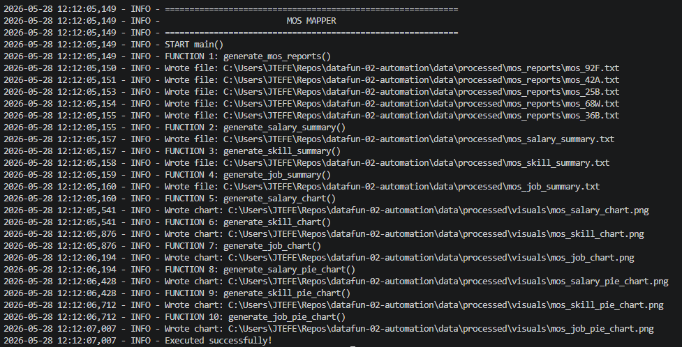

@"
# MOS Mapper — Military MOS to Civilian Job Translator

This project analyzes U.S. Army Military Occupational Specialty (MOS) codes and translates them into civilian career language. It takes structured MOS data—such as job titles, core duties, and required skills—and connects it to civilian job roles, salary ranges, and demand indicators. The goal is to help service members, veterans, and career counselors quickly understand how military experience maps to real-world job opportunities, what pay they might expect, and which skills are most marketable in the civilian workforce. Along the way, the project also generates visualizations and reports that make these relationships easy to explore, compare, and explain.

It is built as a modular Python package using a `src/` layout and runs inside a virtual environment managed with `uv`.

---

## Features

- Generate MOS-specific text reports (one file per MOS)
- Create salary, skill, and job frequency summaries
- Produce bar charts and pie charts using Matplotlib
- Save all outputs under `data/processed/`
- Uses structured logging for clear, readable execution output
- Runs as a module: `uv run python -m mos_mapper.app_mos_mapper`

---

## How to Run

From the project root, with the virtual environment active:
 `uv run python -m mos_mapper.app_mos_mapper`

 # Trigger CI rerun - Justice workflow test

This will:

- Generate MOS text reports in `data/processed/mos_reports/`
- Generate summary text files in `data/processed/`
- Generate charts in `data/processed/visuals/`

---

## Requirements

- Python 3.11+
- uv (recommended)
- Matplotlib
"@ | Set-Content -Path README.md
## Visual Examples

### Salary by MOS

### Salary Distribution (Pie Chart)

## Sample Output

